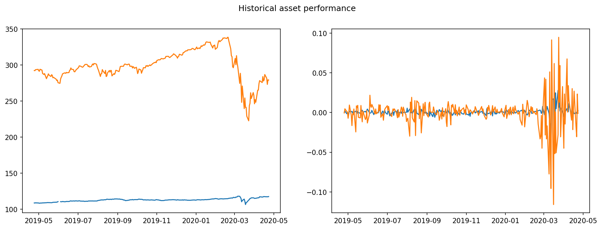
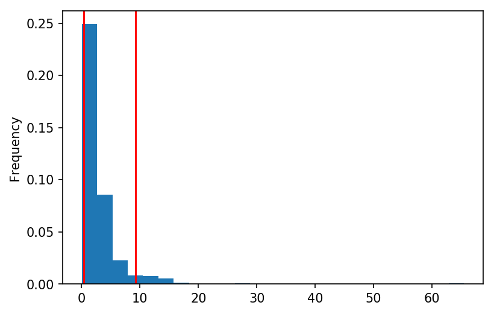
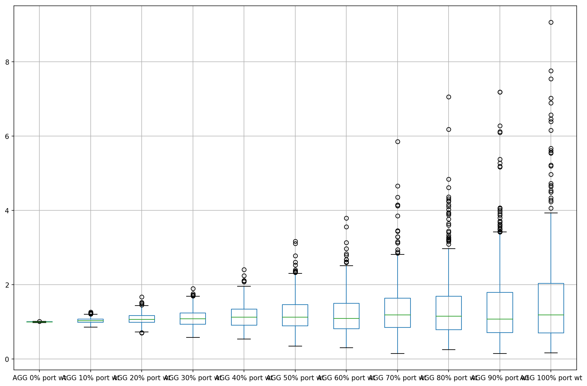
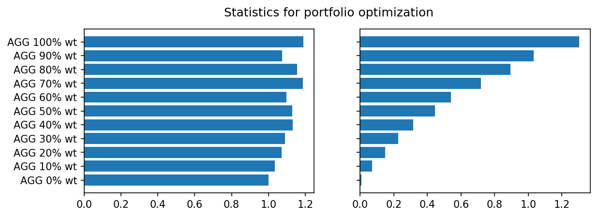
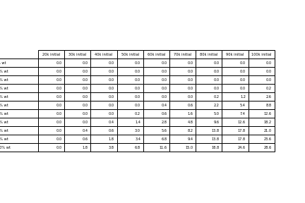

# Financial Analysis 

## Current financial position
Harold recieved 7385 USD in gross income last year and we expect him to recieve 7389 USD in the coming year. Harold believes that this is the minimum revenue needed to support his quality of life.    
#### Harold's income. 

## Current 90 expenditures:
During the last 90 days Food/Drink and Travel ahve been the largest expenditure by number, though transfers and payments have beent he largest expenditures by amount (with food and drink coming in 3rd). 
#### Expenditures by category: type

#### Expenditures by category: amount

It appears that Harold's expenses per month is fairly constant, at ~11k USD/month.  
#### Monthy expenditures by category: 

Also it looks like Harold's monthly expenses by catagory appear consistant month to month.  
#### Monthy expenditures by category: 

budgeting 

#Retirement projections

##portfolio
Harold has been investing in both the iShares Barclays Aggregate Bond Fund (AGG) and the SPDR S&P 500 ETF Trust (SPY) at 40%/60% weighting respective.  The current market has been unfavorable, with a significant decline in the SP500 and also high volitility scene in the following plots (SPY in orange)
#### Asset performance

##30 year time horizon
We ran 1000 simultions out 30 yrs with Harolds portfolio and collected the resulting statistics.  Due to the market downturn coloring the expected returns, the majority of simulations showed a decreae in value of the portfolio over this time horizon.  Also due to the length of the simulation, a large spread was seen in the data.  
#### Simulated returns over 30 years.  

#### Probability of return for 30 year simulation

## Outlook for retirment
Our current projected annual income from Plaid is 7389USD in gross revenues, and we want the value of our portfolio to be such that 4% withdrawl will either equal or exceed this value. The value of our portfolio at at the 10th percentile of our 500 monte carlo simulations, given an intial investment of 20,000USD will be worth 545.84USD. The total value of this portfolio is far below annual projected Plaid revenue, let alone a 4% withdrawl. Based on our simulations, only the top 0.4% percentile will reach the require threshold. Also the final portfolio value will scale linearly with the initial investment. Simply creasing the value by 50% to 30,000USD rather then 20,000USD, from our model, the threshold value of Plaid annual revenue is now exceeded only in the top 0.6% of simulations at 30 years.  We hope Harold LOVES his job.  
#### Returns at 10th, 50th and 95% percentile of simulations:

# Optimization of portfolio:
Harold expressed an interest potentially retiring after 5 years with his current portfolio.  We conducted simulations to optimize the portfolio weight for AGG and SPY.  With 500 simulations per weight at the end of 5 years, we saw that increasing AGG weight resulted in both an increased rturn and also variability.  These simulations do not support early retirement 

#### Simulated returns

#### Median and spread of simulated returns

#### Median return plateus at 70% AGG.  

## Outlook for early retirement with an optimize portfolio:
Based on our analysis of both increasing the early investment from 20k USD to 100k USD and optimizing the potential returns of the AGG/SPY portfolio, we believe Harold will not be able to retire after 5 years, while maintaining his current quality of life as defined as 4% draws from the portfolio equaling or surpassing his current annual income.  The table below shows the what top percentils of the simulation meets this standard and we have no better then 40% confidence that Harolds requirement needs would be met.  

